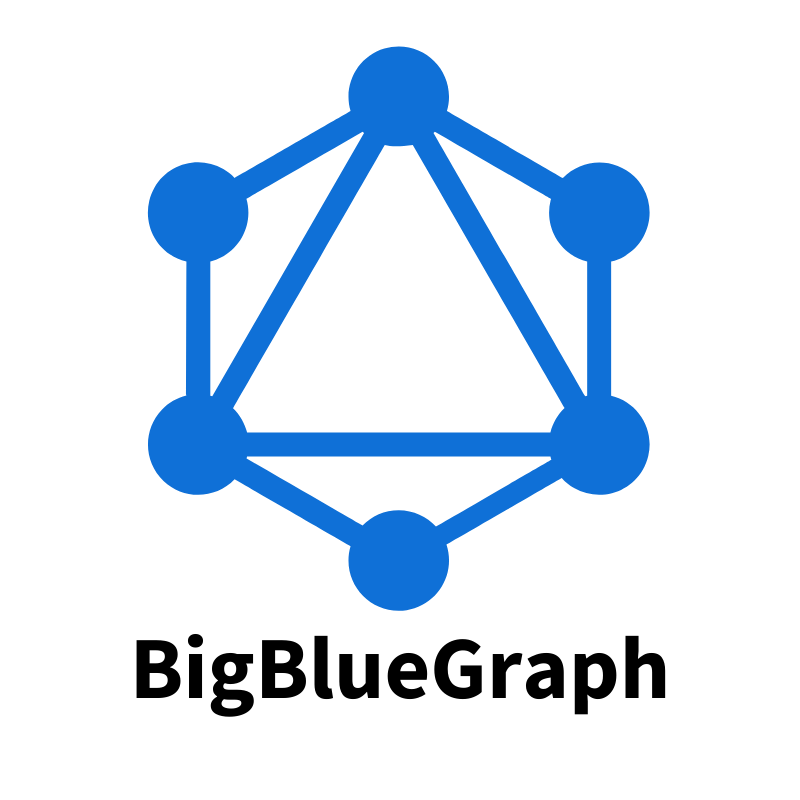

GraphQL wrapper for your BigBlueButton server. Build with [bigbluebutton-js](https://aakatev.github.io/bigbluebutton-js-docs/). 

**This repository is in active development!**

## Installation

Clone repo, and create `.env` file (or export as environmental variables) with the following values:

```env
BBB_URL=https://example.com/bigbluebutton/
BBB_SECRET=bbb-secret-token
APOLLO_KEY=optional-apollo-studio-key
```

`APOLLO_KEY` is optional. Read more about Appollo Studio in the [official documentation](https://www.apollographql.com/docs/studio/).

Now, launch GraphQL server with `npm run start`, and open your browser on [`localhost:4000`](http://localhost:4000).

## Example of Meeting API Usage

```graphql
query GetMeetingsById {
  meeting(id: "random-6811322") {
    id
    name
    running
    attendeePassword
    moderatorPassword
  }
}

mutation CreateMeeting {
  createMeeting(
    id: "random-6811322"
    name: "Test"
    duration: 5
    attendeePassword: "secret"
    moderatorPassword: "supersecret"
  ) {
    success
    message
  }
}

mutation JoinMeetingModerator {
  joinMeeting(id: "random-6811322", username: "Test", password: "supersecret") {
    success
    url
    message
  }
}

mutation JoinMeetingUser {
  joinMeeting(id: "random-6811322", username: "Test", password: "secret") {
    success
    url
    message
  }
}

mutation EndMeeting {
  endMeeting(id: "random-6811322", moderatorPassword: "supersecret") {
    success
    message
  }
}

```

## Example of Recording API Usage

```graphql

query GetRecording {
  recording(id: "41d1a1ff6f3219d667000ce58501f26ea703bc1e-1595623200678") {
    id
    meetingId
    published
    url
  }
}

query GetRecordingByMeetingId1 {
  recordings(meetingId: "random-6811322") {
    id
    meetingId
    published
    url
  }
}

query GetRecordingByMeetingId2 {
  recordings(meetingId: "random-6242490") {
    id
    meetingId
    published
    url
  }
}

mutation DeleteRecording {
  deleteRecording(
    id: "41d1a1ff6f3219d667000ce58501f26ea703bc1e-1595623200678"
  ) {
    success
    message
  }
}

```